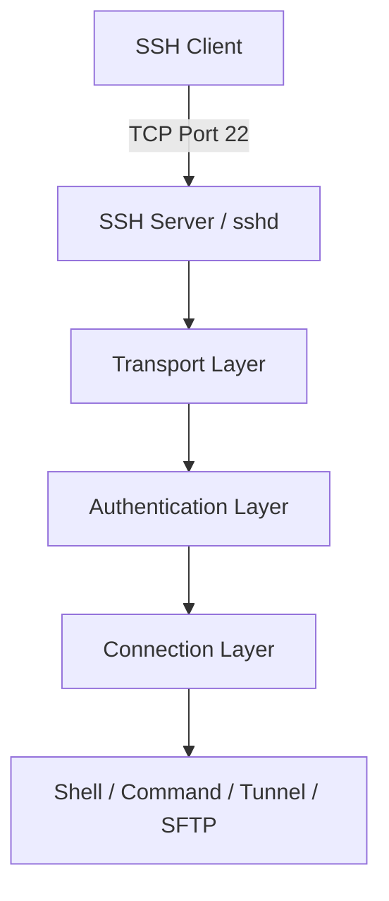
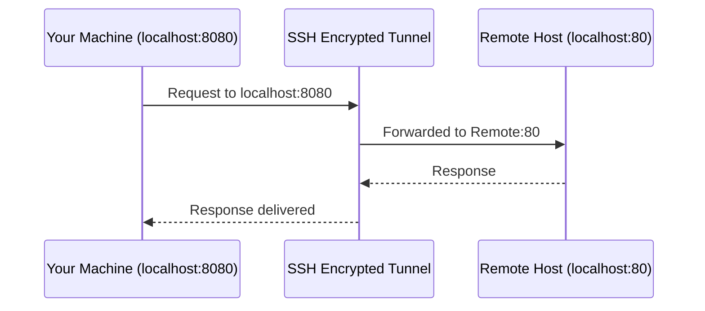
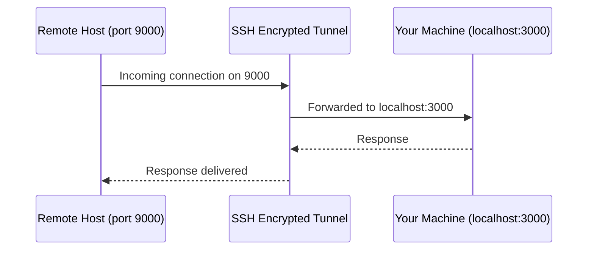
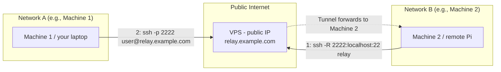

# SSH (Secure Shell)

A complete, production quality reference for using, configuring, and securing SSH from your first connection to advanced tunneling between machines on different networks.

## Table of Contents

1. [What is SSH?](#what-is-ssh)
2. [SSH Architecture](#ssh-architecture)
3. [Installing SSH](#installing-ssh)
4. [Verify Installation](#verify-installation)
5. [Starting and Enabling SSH Server](#starting-and-enabling-ssh-server)
6. [Checking SSH Service Status](#checking-ssh-service-status)
7. [First SSH Connection](#first-ssh-connection)
8. [SSH Syntax](#ssh-syntax)
9. [Common SSH Commands](#common-ssh-commands)
10. [Authentication](#authentication)
11. [SSH Keys](#ssh-keys)
12. [Copying Public Keys](#copying-public-keys)
13. [SSH Config File](#ssh-config-file)
14. [Common SSH Options](#common-ssh-options)
15. [SSH Port Forwarding](#ssh-port-forwarding)
16. [Connecting Two Machines on Different Networks](#connecting-two-machines-on-different-networks)
17. [SCP](#scp)
18. [SFTP](#sftp)
19. [SSH Agent](#ssh-agent)
20. [Managing Known Hosts](#managing-known-hosts)
21. [File Permissions](#file-permissions)
22. [SSH Daemon Configuration](#ssh-daemon-configuration)
23. [Security Best Practices](#security-best-practices)
24. [SSH Troubleshooting](#ssh-troubleshooting)
25. [Useful SSH One-Liners](#useful-ssh-one-liners)
26. [SSH Cheat Sheet](#ssh-cheat-sheet)
27. [Frequently Asked Questions](#frequently-asked-questions)
28. [Practice Exercises](#practice-exercises)
29. [Real-World Examples](#real-world-examples)
30. [Summary](#summary)
31. [Further Reading](#further-reading)

---

## What is SSH?

### Definition

SSH (**Secure Shell**) is a cryptographic network protocol used to operate network services securely over an unsecured network. It provides a secure channel between two machines typically a client and a server over which you can execute commands, transfer files, and forward network traffic.

SSH replaced older, insecure protocols like **Telnet**, **rlogin**, and **FTP**, which transmitted data including passwords in plain text.

### Why SSH Exists

Before SSH, remote administration relied on protocols that offered no encryption. Anyone capturing network traffic (via a packet sniffer, for example) could read usernames, passwords, and session data in plain text.

SSH was created in 1995 by Tatu Ylönen after a password-sniffing attack at his university. It solved three core problems:

| Problem                          | SSH Solution                                           |
| -------------------------------- | ------------------------------------------------------ |
| Data sent in plain text          | End-to-end encryption of the session                   |
| No way to verify server identity | Host key verification                                  |
| Weak or no authentication        | Password, public key, and other authentication methods |

### How It Works

At a high level, an SSH connection goes through these stages:

1. **TCP Connection** — the client connects to the server, typically on port 22.
2. **Protocol Negotiation** — both sides agree on the SSH protocol version and algorithms.
3. **Key Exchange** — client and server generate a shared session key using an algorithm such as Diffie-Hellman, without ever transmitting the key itself.
4. **Server Authentication** — the client verifies the server's identity using its host key.
5. **User Authentication** — the server verifies the client's identity (password, public key, etc.).
6. **Secure Channel Established** — encrypted communication begins; commands, file transfers, or forwarded traffic can flow.

### Encryption Overview

SSH uses a combination of cryptographic techniques:

- **Symmetric encryption** — encrypts the actual session data (e.g., AES). Fast, and both sides share the same key.
- **Asymmetric encryption** — used during key exchange and public key authentication (e.g., RSA, ED25519, ECDSA). Uses a public/private key pair.
- **Hashing** — ensures data integrity during transmission (e.g., SHA-2 family) and is used for key fingerprints.

> **Note**
> SSH does not use asymmetric encryption to encrypt the whole session that would be too slow. Asymmetric cryptography is used to safely establish a symmetric session key, which then handles bulk encryption.

### Authentication Methods

| Method               | Description                                | Security Level                   |
| -------------------- | ------------------------------------------ | -------------------------------- |
| Password             | User enters a password                     | Weak (vulnerable to brute force) |
| Public Key           | Client proves possession of a private key  | Strong                           |
| Keyboard-Interactive | Challenge-response, often used for MFA/OTP | Strong (with MFA)                |
| Host-Based           | Trust based on client machine identity     | Rarely used, weaker              |
| GSSAPI/Kerberos      | Enterprise single sign-on                  | Strong (in managed environments) |

> **Security Best Practice**
> Public key authentication combined with a strong passphrase is the recommended method for almost all use cases. Password authentication should be disabled wherever possible.

---

## SSH Architecture

SSH is built as a layered protocol. Understanding these layers helps when troubleshooting or reasoning about security.



### Client

The SSH client is the program initiating the connection typically the `ssh` command on Linux/macOS, or an OpenSSH-compatible client on Windows. The client is responsible for initiating the handshake, presenting credentials, and rendering the resulting shell or forwarded data.

### Server

The SSH server, usually the `sshd` daemon (part of OpenSSH), listens for incoming connections, authenticates clients, and provides the requested service (shell access, command execution, file transfer, or port forwarding).

### Port 22

By default, SSH listens on **TCP port 22**. This is an IANA registered well-known port. Administrators may change this for obscurity (discussed later), but the protocol itself does not require port 22.

### Transport Layer

Defined in RFC 4253, the Transport Layer handles:

- Initial key exchange
- Server authentication (host key verification)
- Encryption and integrity of all subsequent data
- Optional compression

### Authentication Layer

Defined in RFC 4252, this layer runs on top of the Transport Layer and handles verifying the identity of the connecting user via one or more of the authentication methods listed above.

### Connection Layer

Defined in RFC 4254, the Connection Layer multiplexes the encrypted tunnel into logical channels an interactive shell session, a forwarded TCP port, an SFTP subsystem, or X11 forwarding can all coexist within a single SSH connection.

---

## Installing SSH

Most distributions ship the SSH **client** by default. The SSH **server** (`openssh-server`) usually needs explicit installation.

### Arch Linux

```bash
sudo pacman -S openssh
```

Installs both the OpenSSH client and server packages.

### Ubuntu/Debian

```bash
sudo apt update
sudo apt install openssh-server openssh-client
```

`apt update` refreshes the package index; `apt install` installs the client and server packages.

### Fedora

```bash
sudo dnf install openssh-server openssh-clients
```

`dnf` is Fedora's package manager; this installs both components.

### RHEL

```bash
sudo yum install openssh-server openssh-clients
```

On older RHEL/CentOS systems, `yum` is used instead of `dnf` (modern RHEL 8+ supports both, as `dnf` is the successor to `yum`).

### macOS

```bash
sudo systemsetup -setremotelogin on
```

macOS ships OpenSSH by default. This command enables **Remote Login**, which starts the SSH server. Alternatively, enable it via **System Settings → General → Sharing → Remote Login**.

### Windows (OpenSSH)

```powershell
Add-WindowsCapability -Online -Name OpenSSH.Client~~~~0.0.1.0
Add-WindowsCapability -Online -Name OpenSSH.Server~~~~0.0.1.0
```

Run in an elevated PowerShell prompt. This installs the OpenSSH client and server capabilities built into modern Windows 10/11.

```powershell
Start-Service sshd
Set-Service -Name sshd -StartupType 'Automatic'
```

Starts the SSH server service and configures it to start automatically on boot.

---

## Verify Installation

```bash
ssh -V
```

Prints the installed OpenSSH client version. Useful for confirming installation and checking compatibility with certain flags or algorithms.

```bash
sshd -V
```

Prints the installed OpenSSH server (daemon) version. Note this often prints to `stderr` along with a usage message — this is normal.

> **Tip**
> If `sshd -V` produces "command not found," the server package is not installed — only the client is present.

---

## Starting and Enabling SSH Server

On most modern Linux distributions, `systemd` manages the SSH service.

```bash
sudo systemctl start ssh
```

Starts the SSH server immediately (Debian/Ubuntu service name is usually `ssh`).

```bash
sudo systemctl start sshd
```

Starts the SSH server immediately (Fedora/RHEL/Arch service name is usually `sshd`).

```bash
sudo systemctl enable ssh
```

Configures the SSH server to start automatically at boot.

```bash
sudo systemctl enable --now ssh
```

Combines both actions: enables the service at boot **and** starts it immediately.

> **Note**
> The service name differs between distributions (`ssh` vs `sshd`). If one fails with "Unit not found," try the other.

---

## Checking SSH Service Status

```bash
sudo systemctl status ssh
```

Displays whether the service is active, its process ID, recent log lines, and enabled/disabled state.

```bash
sudo journalctl -u ssh -f
```

Streams live logs for the SSH service — useful for watching connection attempts in real time.

```bash
sudo ss -tlnp | grep ssh
```

Lists listening TCP sockets and filters for SSH, confirming the daemon is actually bound to a port.

---

## First SSH Connection

The most basic SSH command:

```bash
ssh username@host
```

- `username` — the account you want to log in as on the remote machine.
- `host` — the IP address, hostname, or fully qualified domain name (FQDN) of the target machine.

### Example: Connecting by IP Address

```bash
ssh admin@192.168.1.10
```

Connects to the machine at `192.168.1.10` as the user `admin`. Typical for connecting to a device on your local network.

### Example: Connecting by Hostname

```bash
ssh admin@webserver
```

Connects using a hostname that resolves via `/etc/hosts`, local DNS, or your `~/.ssh/config` file (covered later).

### Example: Connecting by Domain Name

```bash
ssh deploy@example.com
```

Connects to a publicly reachable server using its fully qualified domain name. This is the common pattern for connecting to VPS or cloud instances.

> **Note**
> The first time you connect to a new host, SSH will display the server's fingerprint and ask you to confirm it. This protects against man-in-the-middle attacks always verify the fingerprint through a trusted channel if possible.

---

## SSH Syntax

The general syntax for the `ssh` command:

```bash
ssh [options] [user@]hostname [command]
```

| Component  | Description                                                                          |
| ---------- | ------------------------------------------------------------------------------------ |
| `options`  | Flags that modify behavior (port, identity file, forwarding, verbosity, etc.)        |
| `user@`    | Optional — the remote username. If omitted, SSH uses your local username.            |
| `hostname` | Required — IP address, hostname, or domain of the target.                            |
| `command`  | Optional — a single command to run remotely instead of opening an interactive shell. |

### Example: Running a Remote Command

```bash
ssh admin@192.168.1.10 "df -h"
```

Connects, executes `df -h` (disk usage) on the remote machine, prints the output, and immediately disconnects no interactive shell is opened.

---

## Common SSH Commands

Once connected, you are in a normal remote shell. Here are frequently used commands, each explained before use.

### `ssh` — Establish a Connection

```bash
ssh user@host
```

Opens a remote interactive shell session.

### `exit` — Close the Session

```bash
exit
```

Terminates the current shell and closes the SSH connection, returning you to your local terminal. `Ctrl+D` does the same thing.

### `whoami` — Show Current User

```bash
whoami
```

Prints the username you are currently logged in as on the remote machine useful for confirming which account you authenticated as.

### `hostname` — Show Machine Name

```bash
hostname
```

Prints the remote machine's hostname useful for confirming you connected to the intended server, especially when managing many machines.

### `pwd` — Print Working Directory

```bash
pwd
```

Shows your current directory on the remote filesystem. Your starting directory is normally the remote user's home directory.

### `ls` — List Directory Contents

```bash
ls -la
```

Lists all files (including hidden ones, `-a`) in long format (`-l`, showing permissions, owner, size, and modification date) in the current remote directory.

### `uptime` — Show System Uptime and Load

```bash
uptime
```

Displays how long the remote system has been running, the number of logged-in users, and the system load averages a quick health check for a server.

---

## Authentication

### Password Authentication

The client sends a username and password, which the server verifies against its local user database (e.g., `/etc/shadow` on Linux).

```bash
ssh user@host
# Password: ********
```

> **Warning**
> Password authentication is vulnerable to brute-force and credential-stuffing attacks, especially against internet-facing servers. It should be disabled in favor of public key authentication whenever practical (see [Security Best Practices](#security-best-practices)).

### Public Key Authentication

Public key authentication uses a cryptographic key pair instead of a password:

1. You generate a **private key** (kept secret, stays on your machine) and a **public key** (shared with servers).
2. The public key is placed in the server's `~/.ssh/authorized_keys` file.
3. When connecting, the server sends a challenge that only the holder of the matching private key can answer correctly.
4. No password — and no private key material — ever crosses the network.

#### Generating Keys with `ssh-keygen`

```bash
ssh-keygen
```

Launches an interactive wizard that generates a new SSH key pair (defaults to RSA, 3072 bits, on most modern OpenSSH versions), prompting for a save location and an optional passphrase.

**Common `ssh-keygen` options:**

| Option | Description                                                                    |
| ------ | ------------------------------------------------------------------------------ |
| `-t`   | Key type (`rsa`, `ed25519`, `ecdsa`, `dsa` — `dsa` is deprecated and insecure) |
| `-b`   | Key size in bits (relevant for RSA; e.g., `-b 4096`)                           |
| `-f`   | Output file path for the private key                                           |
| `-C`   | Comment, typically an email or label, embedded in the public key               |
| `-N`   | Passphrase (use `-N ""` for no passphrase — not recommended for most cases)    |
| `-p`   | Change the passphrase on an existing key                                       |
| `-R`   | Remove a host's entry from `known_hosts`                                       |
| `-l`   | Show the fingerprint of a key                                                  |
| `-e`   | Export key to a different format                                               |

#### Generating an RSA Key

```bash
ssh-keygen -t rsa -b 4096 -C "lichi@laptop"
```

- `-t rsa` — generates an RSA key pair.
- `-b 4096` — uses a 4096-bit key length for stronger security (RSA below 2048 bits is considered weak).
- `-C "lichi@laptop"` — adds a comment to help identify the key later.

#### Generating an ED25519 Key

```bash
ssh-keygen -t ed25519 -C "lichi@laptop"
```

- `-t ed25519` — generates an ED25519 key, based on elliptic-curve cryptography.
- No `-b` flag is needed — ED25519 has a fixed, secure key size.

#### RSA vs. ED25519

| Aspect                   | RSA                                          | ED25519                                 |
| ------------------------ | -------------------------------------------- | --------------------------------------- |
| Algorithm type           | Integer factorization                        | Elliptic-curve (EdDSA)                  |
| Typical key size         | 3072–4096 bits                               | Fixed 256-bit curve                     |
| Performance              | Slower signing/verification                  | Faster                                  |
| Key file size            | Larger                                       | Much smaller                            |
| Compatibility            | Universally supported, even very old systems | Supported by OpenSSH 6.5+ (2014 onward) |
| Recommended for new keys | Acceptable, use 4096-bit                     | **Preferred** for most modern use cases |

> **Security Best Practice**
> Use ED25519 for new keys unless you must support very old systems or hardware that lacks EdDSA support (e.g., some legacy network appliances). Reserve RSA-4096 for those compatibility cases.

---

## SSH Keys

### Private Key

The private key (e.g., `id_ed25519`, `id_rsa`) must **never** be shared. It proves your identity during authentication. If a passphrase is set, the private key is encrypted at rest, and the passphrase is required to unlock it for use.

### Public Key

The public key (e.g., `id_ed25519.pub`, `id_rsa.pub`) is safe to share. It is placed on remote servers in `~/.ssh/authorized_keys` to permit login. Sharing your public key does not compromise your private key.

### Fingerprints

A fingerprint is a short, fixed-length hash representation of a key, used to verify a key's identity without comparing the entire (much longer) key.

```bash
ssh-keygen -l -f ~/.ssh/id_ed25519.pub
```

- `-l` — display the fingerprint.
- `-f` — path to the key file to inspect.

> **Tip**
> You can add `-v` to `ssh-keygen -l` to render the fingerprint as ASCII art, which some administrators use for quick visual comparison.

---

## Copying Public Keys

### Using `ssh-copy-id`

```bash
ssh-copy-id user@host
```

Automatically copies your default public key (`~/.ssh/id_rsa.pub` or similar) to the remote server's `~/.ssh/authorized_keys` file, creating the `.ssh` directory and setting correct permissions if needed.

```bash
ssh-copy-id -i ~/.ssh/id_ed25519.pub user@host
```

- `-i` — specify which public key file to copy, instead of relying on the default.

### Manual Method

If `ssh-copy-id` is unavailable (e.g., on some minimal or non-Linux systems):

```bash
cat ~/.ssh/id_ed25519.pub | ssh user@host "mkdir -p ~/.ssh && chmod 700 ~/.ssh && cat >> ~/.ssh/authorized_keys && chmod 600 ~/.ssh/authorized_keys"
```

This pipeline:

1. Prints the local public key.
2. Connects to the remote host over SSH.
3. Creates `~/.ssh` if it doesn't exist, with permissions `700`.
4. Appends the key to `authorized_keys`.
5. Sets `authorized_keys` permissions to `600`.

> **Warning**
> SSH will refuse to use `authorized_keys` (or even the whole `.ssh` directory) if permissions are too open. Always confirm the permissions shown in [File Permissions](#file-permissions).

---

## SSH Config File

The SSH client configuration file at `~/.ssh/config` lets you define shortcuts and per-host settings, avoiding long, repetitive commands.

### Example: Multiple Servers with Different Users, Ports, and Identity Files

```
# ~/.ssh/config

Host web1
    HostName 203.0.113.10
    User deploy
    Port 2222
    IdentityFile ~/.ssh/id_ed25519_web1

Host db1
    HostName 203.0.113.20
    User dbadmin
    Port 22
    IdentityFile ~/.ssh/id_ed25519_db1

Host rpi
    HostName 192.168.1.50
    User pi
    IdentityFile ~/.ssh/id_ed25519_rpi
```

With this configuration, `ssh web1` is equivalent to:

```bash
ssh -p 2222 -i ~/.ssh/id_ed25519_web1 deploy@203.0.113.10
```

### Example: `ProxyJump` (Bastion / Jump Host)

```
Host internal-server
    HostName 10.0.0.15
    User admin
    IdentityFile ~/.ssh/id_ed25519_internal
    ProxyJump bastion

Host bastion
    HostName 203.0.113.5
    User jumpuser
    IdentityFile ~/.ssh/id_ed25519_bastion
```

`ProxyJump` tells SSH to first connect to `bastion`, then tunnel the connection to `internal-server` through it — useful when the internal server has no direct public IP.

> **Tip**
> `ProxyJump` (the `-J` flag) replaces the older, more cumbersome `ProxyCommand` with `nc` for most modern use cases.

---

## Common SSH Options

| Option | Description                                                                  |
| ------ | ---------------------------------------------------------------------------- |
| `-p`   | Specify a non-default remote port (e.g., `-p 2222`)                          |
| `-i`   | Specify an identity (private key) file to use                                |
| `-v`   | Verbose mode — basic debug output                                            |
| `-vv`  | More verbose — detailed debug output                                         |
| `-vvv` | Maximum verbosity — full protocol-level debug output                         |
| `-X`   | Enable X11 forwarding (untrusted mode)                                       |
| `-Y`   | Enable trusted X11 forwarding                                                |
| `-L`   | Local port forwarding                                                        |
| `-R`   | Remote port forwarding                                                       |
| `-N`   | Do not execute a remote command (useful for forwarding-only connections)     |
| `-f`   | Send SSH to the background before executing the command                      |
| `-C`   | Enable compression                                                           |
| `-A`   | Enable agent forwarding                                                      |
| `-J`   | Use a jump host (ProxyJump)                                                  |
| `-o`   | Pass an arbitrary configuration option (e.g., `-o StrictHostKeyChecking=no`) |

### Example: Combining Options

```bash
ssh -p 2222 -i ~/.ssh/id_ed25519_web1 -v deploy@203.0.113.10
```

Connects on port `2222`, using a specific identity file, with basic verbose logging enabled.

> **Note**
> `-f` is commonly combined with `-N` for background tunnels: `ssh -f -N -L 8080:localhost:80 user@host` sets up a forwarding tunnel and returns control of the terminal immediately.

---

## SSH Port Forwarding

SSH can tunnel arbitrary TCP traffic through its encrypted channel. This is one of the most powerful and most misunderstood features of SSH.

### Local Forwarding

Local forwarding makes a **remote** service available on your **local** machine.

```bash
ssh -L 8080:localhost:80 user@remote-host
```

- `-L` — local forward.
- `8080` — local port you will connect to.
- `localhost:80` — target address **as seen from the remote host** (here, the remote host's own port 80).
- `user@remote-host` — the SSH server you're tunneling through.

After running this, visiting `http://localhost:8080` on your machine sends traffic through the encrypted SSH tunnel to port 80 on `remote-host`.



### Remote Forwarding

Remote forwarding does the opposite it makes a service on **your local machine** reachable from the **remote** server.

```bash
ssh -R 9000:localhost:3000 user@remote-host
```

- `-R` — remote forward.
- `9000` — port opened on the **remote host**.
- `localhost:3000` — target address on **your local machine**.

Anyone connecting to `remote-host:9000` is transparently forwarded to port `3000` on your local machine.



> **Note**
> By default, `GatewayPorts` is disabled on the server, so a remote forward only binds to the server's loopback interface (`127.0.0.1`), meaning only processes on the server itself can reach it not the wider internet. Enabling `GatewayPorts yes` in `sshd_config` widens this, but has security implications.

### Dynamic SOCKS Proxy

Dynamic forwarding turns SSH into a general-purpose SOCKS proxy.

```bash
ssh -D 1080 user@remote-host
```

- `-D` — dynamic forward.
- `1080` — local port that becomes a SOCKS4/SOCKS5 proxy.

Configuring a browser or application to use `localhost:1080` as a SOCKS proxy routes **all** of its traffic through the SSH tunnel useful for securely browsing through an untrusted network.


---

## Connecting Two Machines on Different Networks

A very common real-world scenario: you have **two machines on two different local networks** (for example, your laptop at home and a Raspberry Pi at a friend's house), and neither has a public IP address you can connect to directly. Both are behind NAT/routers, so a direct `ssh pi@<their-ip>` from outside their network will not work.

The standard solution is to use a **third machine with a public IP address** (a small cloud VPS is the cheapest and most common choice) as a relay point, combined with SSH **remote port forwarding**.

### The Core Idea



1. **Machine 2** (the one you want to reach, e.g., behind a home router with no port forwarding configured) initiates an **outbound** SSH connection to the VPS and opens a remote forward. Outbound connections are almost never blocked by NAT/firewalls, which is why this works even without any router configuration on Machine 2's side.
2. **Machine 1** (where you're sitting) connects to the VPS on the forwarded port. The VPS relays that connection back through the tunnel to Machine 2.

### Step 1 — On Machine 2 (the target you want to reach later)

```bash
ssh -N -R 2222:localhost:22 relayuser@relay.example.com
```

- `-N` — don't run a remote command, just hold the tunnel open.
- `-R 2222:localhost:22` — on the VPS, open port `2222`; forward any connection to it back to `localhost:22` **as seen from Machine 2** (i.e., Machine 2's own SSH server).
- `relayuser@relay.example.com` — the SSH account on your VPS.

This command must keep running for the tunnel to stay alive. In practice, you'd run it as a background service (see the `autossh` tip below) rather than in a manual foreground terminal.

> **Note**
> By default this binds `2222` only to the VPS's loopback interface. If you need Machine 1 to reach it from anywhere (not just from the VPS itself), you either need `GatewayPorts yes` in the VPS's `sshd_config`, or you SSH into the VPS first and then `ssh` to `localhost:2222` from there (see Step 2, option B).

### Step 2 — On Machine 1 (where you're connecting from)

**Option A — if `GatewayPorts` is enabled on the VPS:**

```bash
ssh -p 2222 pi@relay.example.com
```

Connects directly to the VPS on port `2222`, which the VPS relays through the tunnel to Machine 2's SSH server.

**Option B — safer default, no `GatewayPorts` needed:**

```bash
ssh -J relayuser@relay.example.com pi@localhost:2222
```

- `-J` — use the VPS as a jump host.
- `pi@localhost:2222` — from the VPS's own perspective, connect to `localhost:2222` (the forwarded tunnel endpoint), logging in as `pi`.

This keeps the forwarded port private to the VPS itself, and uses the jump-host mechanism to reach it no need to widen the VPS's exposure with `GatewayPorts`.

### Keeping the Tunnel Alive: `autossh`

A plain `ssh -R` tunnel drops if the network hiccups. `autossh` monitors the connection and automatically restarts it.

```bash
autossh -M 0 -N -R 2222:localhost:22 relayuser@relay.example.com \
    -o "ServerAliveInterval 30" -o "ServerAliveCountMax 3"
```

- `-M 0` — disables autossh's own legacy monitoring port and relies on SSH's built-in keepalive instead (recommended with modern OpenSSH).
- `ServerAliveInterval 30` / `ServerAliveCountMax 3` — the client pings the server every 30 seconds and disconnects (triggering an autossh restart) after 3 missed replies.

> **Tip**
> Run the `autossh` command as a `systemd` service on Machine 2 so the tunnel re-establishes automatically after reboots or network drops, without manual intervention.

### Alternative: `ProxyJump` Without a Persistent Tunnel

If Machine 2 already has a permanent, always-on SSH connection (rather than an on-demand one), you can skip the manual tunnel entirely and use `ProxyJump` (`-J`) or a matching `~/.ssh/config` entry with `ProxyJump` to route Machine 1 → VPS → Machine 2 directly, as shown earlier in [SSH Config File](#ssh-config-file). This is the cleanest long-term setup if Machine 2 is reachable through the VPS by its own address (e.g., a VPN like WireGuard/Tailscale connecting both machines, with SSH layered on top).

> **Security Best Practice**
> Restrict the relay account on the VPS to forwarding only — no shell access, no other login purposes. Use a dedicated key pair for the tunnel, and consider `PermitOpen` / `no-pty` restrictions in `authorized_keys` (see below) to limit exactly what that key can do.

#### Restricting a Tunnel-Only Key

In the VPS's `~/.ssh/authorized_keys`, you can prefix the tunnel account's key with restrictions:

```
no-pty,no-agent-forwarding,no-X11-forwarding,permitopen="localhost:2222" ssh-ed25519 AAAA...restricted-tunnel-key
```

This ensures that even if the tunnel key is somehow misused, it can only be used to forward traffic to `localhost:2222` — nothing else.

---

## SCP

`scp` (Secure Copy) copies files between hosts over SSH.

### Upload (Local → Remote)

```bash
scp localfile.txt user@remote-host:/home/user/
```

Copies `localfile.txt` from your machine to the specified directory on the remote host.

### Download (Remote → Local)

```bash
scp user@remote-host:/home/user/remotefile.txt ./
```

Copies `remotefile.txt` from the remote host to your current local directory.

### Recursive Copy (Directories)

```bash
scp -r ./project user@remote-host:/home/user/project
```

- `-r` — recursively copies an entire directory tree.

### Copying Between Two Remote Hosts

```bash
scp user1@host1:/path/file.txt user2@host2:/path/
```

Copies a file directly between two remote machines, routed through your local machine by default (or directly between them with `-3` reversed, depending on `scp` version).

> **Note**
> `scp` is considered legacy by OpenSSH upstream in favor of `sftp` or `rsync -e ssh`, due to weaker error handling in the old SCP protocol. It remains widely used and safe for typical purposes, but for large or scripted transfers, `rsync` is recommended.

---

## SFTP

SFTP (SSH File Transfer Protocol) provides an interactive, feature-rich file transfer session over SSH.

### Starting a Session

```bash
sftp user@remote-host
```

Opens an interactive SFTP prompt (`sftp>`).

### Common SFTP Commands

| Command        | Description                          |
| -------------- | ------------------------------------ |
| `ls`           | List remote directory contents       |
| `lls`          | List **local** directory contents    |
| `cd dir`       | Change remote directory              |
| `lcd dir`      | Change **local** directory           |
| `get file`     | Download a file from remote to local |
| `put file`     | Upload a file from local to remote   |
| `get -r dir`   | Download a directory recursively     |
| `put -r dir`   | Upload a directory recursively       |
| `mkdir dir`    | Create a remote directory            |
| `rm file`      | Delete a remote file                 |
| `exit` / `bye` | Close the SFTP session               |

### Example Session

```bash
sftp deploy@203.0.113.10
sftp> cd /var/www/app
sftp> put build.zip
sftp> ls
sftp> exit
```

Connects, navigates to a remote directory, uploads a file, lists the directory contents, and exits.

---

## SSH Agent

The SSH agent holds decrypted private keys in memory so you don't have to re-enter your passphrase for every connection.

### Starting the Agent

```bash
eval "$(ssh-agent -s)"
```

Starts `ssh-agent` as a background process and exports the environment variables (`SSH_AUTH_SOCK`, `SSH_AGENT_PID`) needed for other tools to find it.

### Adding a Key

```bash
ssh-add ~/.ssh/id_ed25519
```

Decrypts (prompting for the passphrase once) and loads the private key into the running agent. Subsequent SSH connections using that key won't prompt again for the session.

### Listing Loaded Keys

```bash
ssh-add -l
```

Lists fingerprints of all keys currently loaded in the agent.

### Removing Keys

```bash
ssh-add -d ~/.ssh/id_ed25519
```

Removes a specific key from the agent.

```bash
ssh-add -D
```

Removes **all** keys from the agent.

> **Security Best Practice**
> Avoid enabling `-A` (agent forwarding) when connecting to servers you don't fully trust. A compromised remote server with agent forwarding enabled can potentially use your forwarded agent to authenticate as you elsewhere, without ever obtaining your private key file itself.

---

## Managing Known Hosts

`~/.ssh/known_hosts` stores the host keys of servers you've previously connected to, so SSH can detect if a server's identity changes unexpectedly (a potential man-in-the-middle attack).

### Removing an Outdated Entry

```bash
ssh-keygen -R 203.0.113.10
```

- `-R` — removes all entries for the specified host from `known_hosts`. Use this when a server has been legitimately rebuilt or its host key regenerated, and you're getting a "host key verification failed" warning.

### Fingerprint Verification

When connecting to an unknown host for the first time, SSH shows a prompt like:

```
The authenticity of host '203.0.113.10 (203.0.113.10)' can't be established.
ED25519 key fingerprint is SHA256:abcd1234...
Are you sure you want to continue connecting (yes/no/[fingerprint])?
```

You should compare this fingerprint against one obtained through a separate, trusted channel (e.g., your cloud provider's control panel, which often displays the host key fingerprint for new instances) before typing `yes`.

> **Warning**
> Never blindly accept unknown fingerprints on sensitive systems, and never use `-o StrictHostKeyChecking=no` as a permanent habit — it silently disables this protection.

---

## File Permissions

SSH is strict about file and directory permissions related to keys — overly permissive settings cause SSH to refuse to use them.

| Path                                                | Required Permissions | Explanation                                                          |
| --------------------------------------------------- | -------------------- | -------------------------------------------------------------------- |
| `~/.ssh`                                            | `700` (`drwx------`) | Only the owner can access the directory at all                       |
| `~/.ssh/id_rsa` / `id_ed25519` (private key)        | `600` (`-rw-------`) | Only the owner can read/write; no one else can view the private key  |
| `~/.ssh/id_rsa.pub` / `id_ed25519.pub` (public key) | `644` (`-rw-r--r--`) | Safe to be world-readable — it's public by design                    |
| `~/.ssh/authorized_keys`                            | `600` (`-rw-------`) | Prevents other local users from adding their own keys to gain access |
| `~/.ssh/known_hosts`                                | `644` (`-rw-r--r--`) | Read access is fine; only the owner should modify it                 |

### Fixing Permissions

```bash
chmod 700 ~/.ssh
chmod 600 ~/.ssh/id_ed25519
chmod 644 ~/.ssh/id_ed25519.pub
chmod 600 ~/.ssh/authorized_keys
```

> **Tip**
> If you see `"Permissions 0644 for '~/.ssh/id_rsa' are too open"`, this permissions table is the fix — SSH is refusing to use an improperly protected private key.

---

## SSH Daemon Configuration

The server-side configuration file is located at `/etc/ssh/sshd_config`. After editing it, reload the service:

```bash
sudo systemctl restart ssh
```

> **Warning**
> Always test configuration changes with `sudo sshd -t` before restarting, and keep an existing SSH session open while testing changes a misconfiguration can lock you out of a remote server.

### Important Directives

| Directive                | Purpose                                    | Example                     |
| ------------------------ | ------------------------------------------ | --------------------------- |
| `Port`                   | Port sshd listens on                       | `Port 2222`                 |
| `PermitRootLogin`        | Whether root can log in directly           | `PermitRootLogin no`        |
| `PasswordAuthentication` | Enable/disable password logins             | `PasswordAuthentication no` |
| `PubkeyAuthentication`   | Enable/disable public key logins           | `PubkeyAuthentication yes`  |
| `AllowUsers`             | Whitelist specific users                   | `AllowUsers deploy admin`   |
| `AllowGroups`            | Whitelist specific groups                  | `AllowGroups sshusers`      |
| `MaxAuthTries`           | Max failed auth attempts before disconnect | `MaxAuthTries 3`            |
| `LoginGraceTime`         | Time allowed to complete authentication    | `LoginGraceTime 30`         |
| `ClientAliveInterval`    | Seconds between keepalive checks           | `ClientAliveInterval 300`   |
| `ClientAliveCountMax`    | Missed keepalives before disconnect        | `ClientAliveCountMax 2`     |
| `X11Forwarding`          | Enable/disable X11 forwarding              | `X11Forwarding no`          |

### Example Hardened Configuration Snippet

```
Port 2222
PermitRootLogin no
PasswordAuthentication no
PubkeyAuthentication yes
AllowUsers deploy admin
MaxAuthTries 3
LoginGraceTime 20
ClientAliveInterval 300
ClientAliveCountMax 2
X11Forwarding no
```

---

## Security Best Practices

> **Security Best Practice**
> Layer multiple protections — no single setting makes a server "secure." Defense in depth is the goal.

- **Disable root login** (`PermitRootLogin no`) — force administrators to log in as an unprivileged user and use `sudo`, creating an audit trail.
- **Disable password authentication** (`PasswordAuthentication no`) — eliminates brute-force and credential-stuffing risk entirely; only key holders can authenticate.
- **Use ED25519 keys** — smaller, faster, and modern; avoid deprecated `DSA` keys entirely.
- **Change the default port** — reduces automated, opportunistic scanning noise in logs, but is **security through obscurity only**; it does not stop a targeted attacker who port-scans. Always combine it with real controls, not as a substitute for them.
- **Fail2Ban** — monitors auth logs and temporarily bans IPs after repeated failed login attempts.
- **Firewall rules** — restrict which IP ranges can even reach port 22/your custom SSH port (e.g., via `ufw`, `firewalld`, or cloud security groups).
- **Keep software updated** — apply OpenSSH and OS security patches promptly.
- **Strong passphrases on private keys** — protects the key itself if the key file is ever stolen.
- **Key rotation** — periodically regenerate and redistribute keys, especially after staff turnover.
- **Least privilege** — restrict `authorized_keys` entries with `command=`, `no-pty`, `permitopen=` where a key only needs to perform one narrow task.
- **Restrict users/groups** — use `AllowUsers`/`AllowGroups` to explicitly whitelist who may connect at all.
- **Audit logs** — regularly review `/var/log/auth.log` (Debian/Ubuntu) or `journalctl -u sshd` (systemd-based) for suspicious activity.

### Example: Installing Fail2Ban for SSH

```bash
sudo apt install fail2ban
sudo systemctl enable --now fail2ban
```

Installs Fail2Ban and enables it to start on boot; its default `sshd` jail begins monitoring authentication logs immediately.

---

## SSH Troubleshooting

| Error                                    | Common Cause                                                        | Solution                                                                                                      |
| ---------------------------------------- | ------------------------------------------------------------------- | ------------------------------------------------------------------------------------------------------------- |
| `Permission denied (publickey)`          | Wrong key, key not added to `authorized_keys`, or wrong permissions | Verify correct `-i` key, check `authorized_keys` on server, fix permissions                                   |
| `Host key verification failed`           | Server's host key changed (rebuild, reinstall, or possible MITM)    | Verify legitimacy, then `ssh-keygen -R host` to remove the stale entry                                        |
| `Connection refused`                     | SSH service not running, or wrong port                              | Check `systemctl status ssh`, confirm correct port with `-p`                                                  |
| `Connection timed out`                   | Firewall blocking the port, or host unreachable                     | Check firewall/security group rules, verify network connectivity (`ping`, `traceroute`)                       |
| `Too many authentication failures`       | Client offering too many keys before the right one is tried         | Use `-o IdentitiesOnly=yes -i /path/to/key` to force a specific key                                           |
| `REMOTE HOST IDENTIFICATION HAS CHANGED` | Same as host key verification failure, more urgent phrasing         | Confirm the change is expected, then remove old entry with `ssh-keygen -R`                                    |
| `Broken pipe`                            | Network interruption or idle timeout                                | Configure `ServerAliveInterval` client-side or `ClientAliveInterval` server-side to keep the connection alive |

### Diagnostic Approach

```bash
ssh -vvv user@host
```

Running with maximum verbosity shows exactly which authentication methods were tried, which keys were offered, and where the handshake failed — the single most useful troubleshooting command.

---

## Useful SSH One-Liners

1. `ssh user@host` — basic connection.
2. `ssh -p 2222 user@host` — connect on a custom port.
3. `ssh -i ~/.ssh/mykey user@host` — connect with a specific key.
4. `ssh -o IdentitiesOnly=yes -i ~/.ssh/mykey user@host` — force only one key to be offered.
5. `ssh user@host "uname -a"` — run one remote command and exit.
6. `ssh user@host "sudo systemctl restart nginx"` — restart a remote service.
7. `ssh -L 8080:localhost:80 user@host` — local port forward.
8. `ssh -R 9000:localhost:3000 user@host` — remote port forward.
9. `ssh -D 1080 user@host` — dynamic SOCKS proxy.
10. `ssh -f -N -L 3306:localhost:3306 user@host` — background tunnel to a remote database.
11. `ssh -J bastion user@internal-host` — connect through a jump host.
12. `ssh -A user@host` — connect with agent forwarding enabled.
13. `ssh -X user@host` — connect with X11 forwarding.
14. `ssh -C user@host` — connect with compression enabled (helps on slow links).
15. `scp file.txt user@host:/tmp/` — upload a file.
16. `scp user@host:/tmp/file.txt .` — download a file.
17. `scp -r ./folder user@host:/tmp/` — upload a directory recursively.
18. `rsync -avz -e ssh ./folder user@host:/tmp/` — sync a directory efficiently over SSH.
19. `sftp user@host` — start an interactive file transfer session.
20. `ssh-keygen -t ed25519 -C "label"` — generate a new ED25519 key pair.
21. `ssh-copy-id user@host` — copy your public key to a server.
22. `ssh-add ~/.ssh/id_ed25519` — load a key into the agent.
23. `ssh-add -l` — list keys currently loaded in the agent.
24. `ssh-keygen -R host` — remove a stale host key entry.
25. `ssh-keygen -lf ~/.ssh/id_ed25519.pub` — show a key's fingerprint.
26. `ssh -vvv user@host` — maximum verbosity for debugging.
27. `ssh user@host -o ConnectTimeout=5` — fail fast if the host is unreachable.
28. `ssh user@host -o ServerAliveInterval=60` — keep idle connections alive.
29. `ssh user@host 'tail -f /var/log/syslog'` — stream a remote log file live.
30. `ssh user@host 'ps aux | grep nginx'` — check a remote process remotely.
31. `ssh user@host 'df -h'` — check remote disk usage.
32. `for h in host1 host2 host3; do ssh "$h" uptime; done` — check uptime across multiple servers in a loop.
33. `ssh user@host mkdir -p /tmp/newfolder` — create a remote directory without logging in interactively.

---

## SSH Cheat Sheet

| Task                    | Command                                         |
| ----------------------- | ----------------------------------------------- |
| Basic connection        | `ssh user@host`                                 |
| Custom port             | `ssh -p 2222 user@host`                         |
| Specific key            | `ssh -i keyfile user@host`                      |
| Run remote command      | `ssh user@host "command"`                       |
| Generate ED25519 key    | `ssh-keygen -t ed25519`                         |
| Generate RSA key        | `ssh-keygen -t rsa -b 4096`                     |
| Copy public key         | `ssh-copy-id user@host`                         |
| Local forward           | `ssh -L localport:target:targetport user@host`  |
| Remote forward          | `ssh -R remoteport:target:targetport user@host` |
| Dynamic proxy           | `ssh -D localport user@host`                    |
| Jump host               | `ssh -J jumphost user@target`                   |
| Copy file (upload)      | `scp file user@host:/path/`                     |
| Copy file (download)    | `scp user@host:/path/file .`                    |
| Interactive transfer    | `sftp user@host`                                |
| Start agent             | `eval "$(ssh-agent -s)"`                        |
| Add key to agent        | `ssh-add keyfile`                               |
| Remove stale host key   | `ssh-keygen -R host`                            |
| Show fingerprint        | `ssh-keygen -lf keyfile.pub`                    |
| Debug connection        | `ssh -vvv user@host`                            |
| Restart SSH server      | `sudo systemctl restart ssh`                    |
| Check SSH server status | `sudo systemctl status ssh`                     |

---

## Frequently Asked Questions

**1. What port does SSH use by default?**
Port 22 (TCP).

**2. Is SSH the same as SSL/TLS?**
No. Both provide encryption, but SSH is a distinct protocol designed for remote shell access and tunneling, while SSL/TLS is primarily used to secure web (HTTPS) and other application traffic.

**3. Can I use SSH without a password?**
Yes — that's the purpose of public key authentication.

**4. Is it safe to disable password authentication entirely?**
Generally yes, and recommended, as long as you have reliable key-based access already configured and tested before disabling it.

**5. What happens if I lose my private key?**
You lose the ability to authenticate with it. You'll need to generate a new key pair and add the new public key to every server's `authorized_keys` (assuming you still have another way to access those servers).

**6. Should I use the same SSH key for every server?**
It's more secure to use separate keys per purpose or per trust boundary, so a compromise of one key doesn't grant access everywhere.

**7. What's the difference between `~/.ssh/config` and `/etc/ssh/sshd_config`?**
`~/.ssh/config` configures client-side behavior (per-user, per-host shortcuts). `/etc/ssh/sshd_config` configures the server daemon's behavior system-wide.

**8. Why does changing the SSH port improve security?**
It mainly reduces log noise from automated bots scanning port 22 — it does not stop a determined, targeted attacker who scans all ports.

**9. What is a host key, and why does SSH warn me about it?**
A host key uniquely identifies a server. SSH warns you when it changes because that could indicate the server was rebuilt legitimately or that you're being intercepted by an attacker (MITM).

**10. Can SSH keys have passphrases?**
Yes, and it's strongly recommended — a passphrase protects the private key file even if it's stolen.

**11. What is `known_hosts`?**
A local file recording the host keys of servers you've previously connected to, used to detect unexpected changes.

**12. Why do I get "Too many authentication failures"?**
Your SSH agent or config is offering too many keys to the server, exceeding `MaxAuthTries`. Use `IdentitiesOnly=yes` with a specific `-i` key.

**13. What is agent forwarding, and is it risky?**
Agent forwarding lets a remote server use your local SSH agent to authenticate onward to other hosts. It's risky on untrusted servers, since a compromised server could misuse the forwarded agent.

**14. Can I run graphical applications over SSH?**
Yes, using X11 forwarding (`-X` or `-Y`), assuming an X server is available to render the display locally.

**15. What's the difference between SCP and SFTP?**
SCP is a simple, one-shot file copy tool; SFTP is a full interactive file transfer protocol with directory browsing, resuming, and more granular operations.

**16. Is Telnet still used anywhere?**
Rarely for anything security-sensitive; it survives mainly for legacy equipment management on isolated/trusted networks, since it transmits everything in plain text.

**17. What is `ProxyJump`, and when should I use it?**
It lets you tunnel an SSH connection through one or more intermediate ("jump") hosts — commonly used to reach internal servers that have no direct public IP.

**18. How do I connect to two machines on different networks without port forwarding on my router?**
Use a public relay (e.g., a small VPS) and SSH remote forwarding, as detailed in [Connecting Two Machines on Different Networks](#connecting-two-machines-on-different-networks).

**19. What's the safest way to allow only specific users to SSH in?**
Use `AllowUsers` or `AllowGroups` in `sshd_config`, combined with key-only authentication.

**20. Does SSH protect against all attacks?**
No single tool provides complete protection. SSH secures the transport and authentication, but overall security also depends on system hardening, patching, monitoring, and sound key management.

---

## Practice Exercises

### Beginner

1. Install OpenSSH server on a virtual machine and connect to it from another machine on the same network.
2. Generate an ED25519 key pair and use `ssh-copy-id` to authorize it on a test server.
3. Disable password authentication on your test server and confirm key-based login still works.
4. Use `scp` to upload and then download a file from your test server.

### Intermediate

5. Create an `~/.ssh/config` entry for at least three different hosts with different users, ports, and identity files.
6. Set up local port forwarding to access a web service running only on a remote server's `localhost`.
7. Configure Fail2Ban on your test server and verify it bans an IP after repeated failed logins.
8. Restrict a user to SFTP-only access using `sshd_config`'s `Match` block and `ForceCommand internal-sftp`.

### Advanced

9. Set up a VPS as a relay and use SSH remote forwarding to reach a machine behind NAT that has no port forwarding configured on its router.
10. Configure a tunnel-only `authorized_keys` entry restricted with `no-pty` and `permitopen`.
11. Automate a persistent reverse tunnel using `autossh` and a `systemd` service file.
12. Harden a server end-to-end: disable root login and passwords, change the port, configure `AllowUsers`, install Fail2Ban, and verify with `ssh -vvv` that only key auth succeeds.

---

## Real-World Examples

### Managing a VPS

```bash
ssh -i ~/.ssh/id_ed25519_vps deploy@203.0.113.10
```

Typical daily-driver connection to a cloud server using a dedicated key, often simplified into a single `ssh vps` alias via `~/.ssh/config`.

### GitHub Authentication

```bash
ssh-keygen -t ed25519 -C "github-lichi"
ssh-copy-id # not used for GitHub — instead paste the .pub key into GitHub's SSH key settings
ssh -T git@github.com
```

GitHub doesn't accept `ssh-copy-id` since you don't have shell access to their servers — instead, the public key is pasted into your GitHub account settings. `ssh -T git@github.com` tests the connection.

### Connecting to a Raspberry Pi

```bash
ssh pi@raspberrypi.local
```

Uses mDNS (`.local` hostname resolution, via Avahi/Bonjour) to reach a Pi on the local network without knowing its IP address.

### Connecting to Cloud Servers

```bash
ssh -i ~/.ssh/aws_key.pem ec2-user@ec2-203-0-113-10.compute-1.amazonaws.com
```

Cloud providers often issue a `.pem` private key file at instance creation; the default username varies by provider/image (`ec2-user`, `ubuntu`, `admin`, etc.).

### Remote Development with VS Code

VS Code's **Remote - SSH** extension uses your existing `~/.ssh/config` entries to open a full development environment on a remote machine, running the editor UI locally while executing everything else (terminal, extensions, language servers) on the remote host.

### Remote Backups

```bash
rsync -avz -e "ssh -i ~/.ssh/id_ed25519_backup" /home/user/data/ backupuser@backup-host:/backups/user-data/
```

Combines `rsync` with SSH as the secure transport for efficient, incremental backups.

### SSH Tunneling — Reaching Two Machines Across Different Networks

As covered in detail earlier, using a VPS as a relay with `ssh -R` lets you reach a home server, Raspberry Pi, or lab machine that sits behind NAT on a completely different network than the one you're connecting from without any router configuration required on the target's side. This pattern underlies many remote-access tools (e.g., commercial "connect to my home PC" services) that are, under the hood, automated SSH reverse tunnels.

---

## Summary

SSH is the foundation of secure remote administration, file transfer, and encrypted tunneling on modern systems. A solid working knowledge of SSH means understanding:

- How the protocol establishes trust and encrypts traffic (transport, authentication, and connection layers).
- How to generate, manage, and protect key pairs — preferring ED25519 for new keys.
- How to configure both the client (`~/.ssh/config`) and server (`/etc/ssh/sshd_config`) for convenience and security.
- How to use port forwarding — local, remote, and dynamic — to securely reach services across network boundaries, including linking two machines on entirely separate networks through a public relay.
- How to harden a server against common attacks: disabling weak authentication, restricting users, monitoring logs, and applying least privilege to keys.

Mastering these fundamentals is essential groundwork for further work in system administration, DevOps, and offensive/defensive security.

---

## Further Reading

- OpenSSH Documentation — https://www.openssh.com/manual.html
- Linux man pages — `man ssh`, `man sshd_config`, `man ssh-keygen`, `man ssh_config`
- Mozilla SSH Guidelines — https://infosec.mozilla.org/guidelines/openssh
- GitHub SSH Documentation — https://docs.github.com/en/authentication/connecting-to-github-with-ssh

---

## Practice Exercises

### Beginner

1. Install OpenSSH client and server on a VM, then connect to `localhost` over SSH.
2. Run `whoami`, `hostname`, and `pwd` on a remote machine via SSH.
3. Generate an ED25519 key pair and inspect its fingerprint.

### Intermediate

1. Set up passwordless login to a remote server using `ssh-copy-id`.
2. Write a `~/.ssh/config` entry with a custom alias, port, and identity file, then connect using only the alias.
3. Use `-L` to forward a remote web server's port 80 to your local port 8080 and view it in a browser.

### Advanced

1. Set up a `ProxyJump` configuration to reach an internal-only server through a bastion host.
2. Configure a VPS as a relay and use SSH remote forwarding to reach a machine behind NAT on a different network, as described in [Connecting Two Machines on Different Networks](#connecting-two-machines-on-different-networks).
3. Harden an `sshd_config`: disable root login and password authentication, restrict to a specific user group, and verify Fail2Ban is actively monitoring the service.

---

## Real-World Examples

### Managing a VPS

```bash
ssh -i ~/.ssh/id_ed25519_vps deploy@203.0.113.10
```

Typical daily-driver connection to a cloud server for deployments and maintenance, using a dedicated key.

### GitHub Authentication

```bash
ssh -T git@github.com
```

Tests SSH authentication against GitHub using your registered public key — GitHub replies with a greeting rather than a shell, confirming the key works for Git operations like `git clone git@github.com:user/repo.git`.

### Connecting to a Raspberry Pi

```bash
ssh pi@raspberrypi.local
```

Uses mDNS (`.local` hostname resolution via Avahi/Bonjour) to reach a Pi on the same local network without knowing its IP address.

### Connecting to Cloud Servers

```bash
ssh -i ~/.ssh/aws_key.pem ec2-user@ec2-203-0-113-10.compute-1.amazonaws.com
```

Typical pattern for AWS EC2: a provider-issued `.pem` key file and a default username that varies by AMI (`ec2-user`, `ubuntu`, `admin`, etc.).

### Remote Development with VS Code

VS Code's "Remote - SSH" extension uses your existing `~/.ssh/config` entries to open a full development environment on a remote machine, running the editor UI locally while all processes, terminals, and file access happen remotely — no manual `scp` round-tripping required.

### Remote Backups

```bash
rsync -avz -e "ssh -i ~/.ssh/id_ed25519_backup" /data/ backupuser@backup-host:/backups/data/
```

Efficiently syncs only changed files to a remote backup server over an encrypted SSH transport, ideal for scheduled cron-based backups.

### SSH Tunneling for a Remote Database

```bash
ssh -f -N -L 5432:localhost:5432 user@db-host
```

Opens a background tunnel so a local database client (e.g., `psql`) can connect to `localhost:5432` while traffic is actually encrypted and routed to the remote PostgreSQL server — avoiding exposing the database port directly to the internet.

---

## Summary

SSH is the foundation of secure remote administration: it authenticates users, encrypts every byte exchanged, and provides a flexible transport for shells, file transfers, and arbitrary port forwarding. A solid grasp of key-based authentication, the client config file, port forwarding, and `sshd_config` hardening covers the overwhelming majority of real-world usage — from managing a single VPS to relaying connections between machines on entirely separate networks. Treat private keys as sensitive credentials, keep the daemon patched and tightly configured, and verify host identities rather than clicking past warnings.

---

## Further Reading

- [OpenSSH Official Documentation](https://www.openssh.com/manual.html)
- [Linux man pages — `ssh(1)`](https://man.openbsd.org/ssh)
- [Linux man pages — `sshd(8)`](https://man.openbsd.org/sshd)
- [Linux man pages — `ssh-keygen(1)`](https://man.openbsd.org/ssh-keygen)
- [Linux man pages — `ssh_config(5)`](https://man.openbsd.org/ssh_config)
- [Linux man pages — `sshd_config(5)`](https://man.openbsd.org/sshd_config)
- [Mozilla OpenSSH Security Guidelines](https://infosec.mozilla.org/guidelines/openssh)
- [GitHub Docs — Connecting to GitHub with SSH](https://docs.github.com/en/authentication/connecting-to-github-with-ssh)
